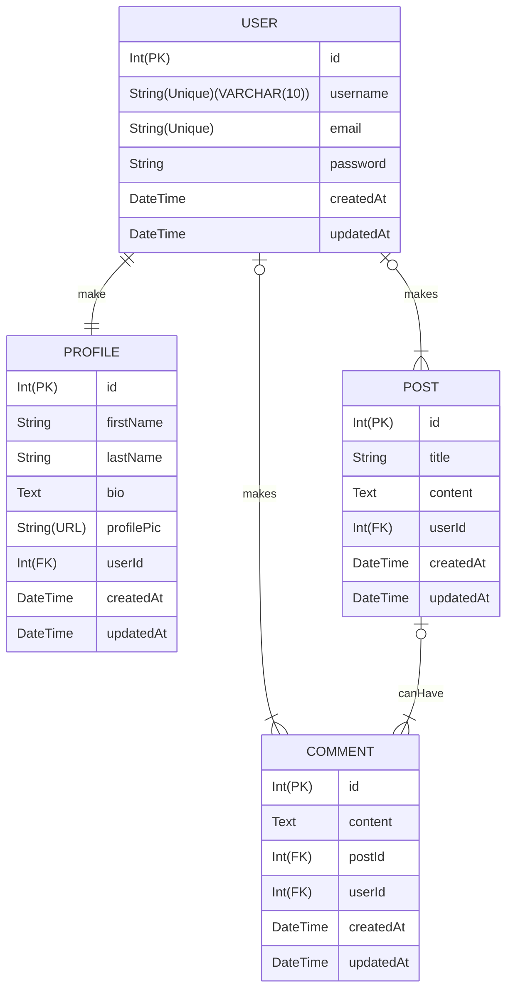

# Enitity Relational Diagram

```mermaid
erDiagram

USER ||--|| PROFILE : make

USER {
    Int(PK) id
    String(Unique)(VARCHAR(10)) username
    String(Unique) email
    String   password
    DateTime createdAt
    DateTime updatedAt
}

USER |o--|{ POST : makes

PROFILE {
    Int(PK) id
    String firstName
    String lastName
    Text bio
    String(URL) profilePic
    Int(FK) userId
    DateTime createdAt
    DateTime updatedAt
}

USER|o--|{ COMMENT : makes

COMMENT {
    Int(PK) id
    Text content
    Int(FK) postId
    Int(FK) userId
    DateTime createdAt
    DateTime updatedAt
}

POST |o--|{ COMMENT : canHave

POST {
    Int(PK) id
    String title
    Text content
    Int(FK) userId
    DateTime createdAt
    DateTime updatedAt
}
```
