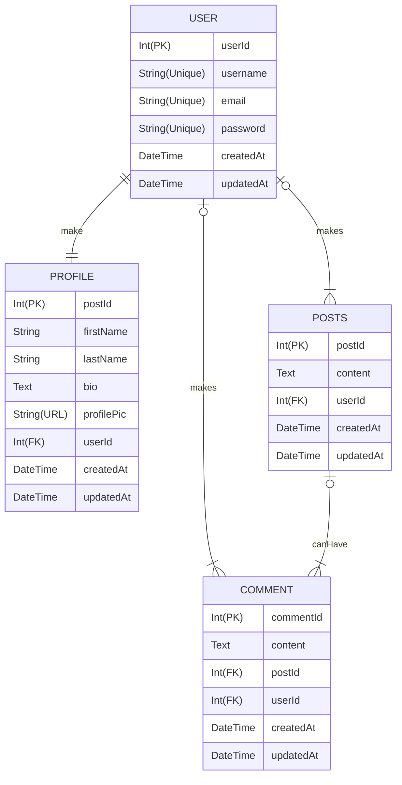

# Enitity Relational Diagram

```mermaid
erDiagram

USER ||--|| PROFILE : make

USER {
    Int(PK) userId
    String(Unique) username
    String(Unique) email
    String(Unique) password
    DateTime createdAt
    DateTime updatedAt
}

USER |o--|{ POSTS : makes

PROFILE {
    Int(PK) postId
    String firstName
    String lastName
    Text bio
    String(URL) profilePic
    Int(FK) userId
    DateTime createdAt
    DateTime updatedAt
}

USER|o--|{ COMMENT : makes

COMMENT {
    Int(PK) commentId
    Text content
    Int(FK) postId
    Int(FK) userId
    DateTime createdAt
    DateTime updatedAt
}

POSTS |o--|{ COMMENT : canHave

POSTS {
    Int(PK) postId
    Text content
    Int(FK) userId
    DateTime createdAt
    DateTime updatedAt
}
```
