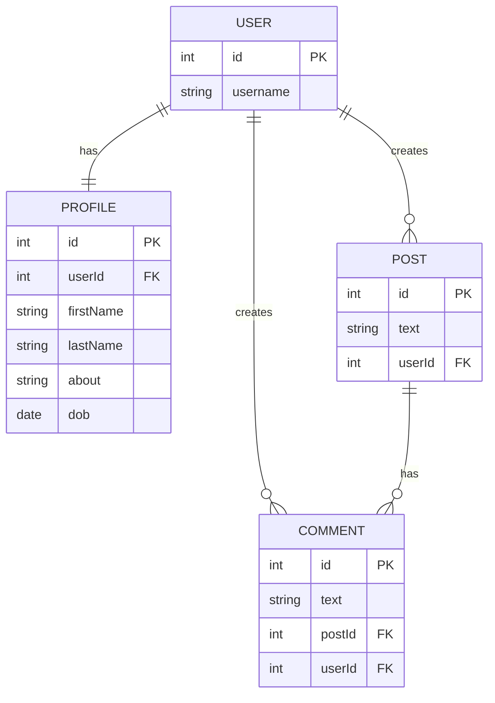

# ERD

```mermaid
erDiagram
USER ||--|| PROFILE : has
USER ||--o{ POST : creates
USER ||--o{ COMMENT : creates
POST ||--o{ COMMENT : has

USER {
    int     id          PK
    string  username
}
COMMENT {
    int     id          PK
    string  text
    int     postId      FK
    int     userId      FK
}
PROFILE {
    int     id          PK
    int     userId      FK
    string  firstName
    string  lastName
    string  about
    date    dob
}
POST {
    int     id          PK
    string  text
    int     userId      FK
}

```

NOTE: all entities also have a createdAt property, as well as an updatedAt property
