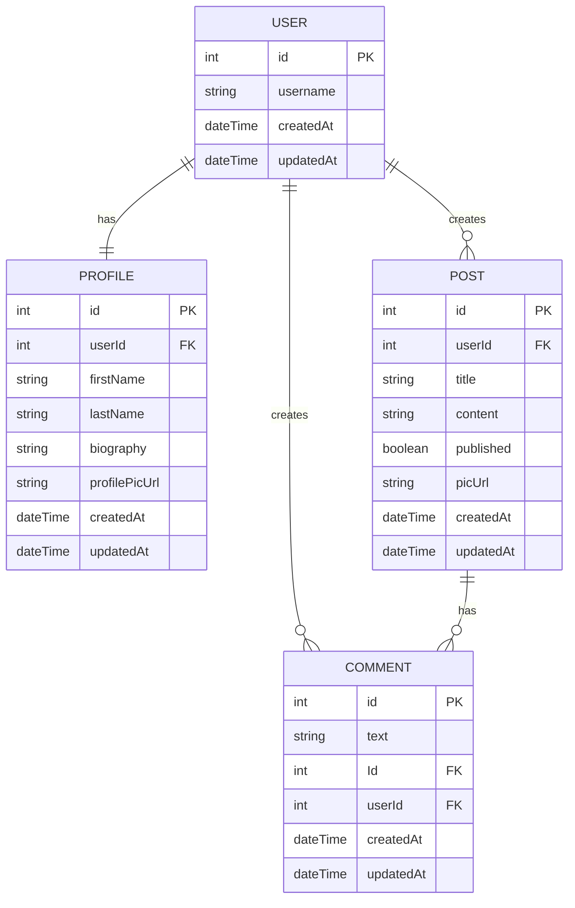

# ERD

```mermaid
erDiagram
USER ||--|| PROFILE : has
USER ||--o{ POST : creates
USER ||--o{ COMMENT : creates
POST ||--o{ COMMENT : has

USER {
    int         id          PK
    string      username
    dateTime    createdAt
    dateTime    updatedAt 
}
COMMENT {
    int         id          PK
    string      text
    int         Id      FK
    int         userId      FK
    dateTime    createdAt
    dateTime    updatedAt 
}
PROFILE {
    int         id          PK
    int         userId      FK
    string      firstName
    string      lastName
    string      biography   
    string      profilePicUrl 
    dateTime    createdAt
    dateTime    updatedAt 
}
POST {
    int         id          PK
    int         userId      FK
    string      title       
    string      content     
    boolean     published    
    string      picUrl                 
    dateTime    createdAt
    dateTime    updatedAt 
}

```
