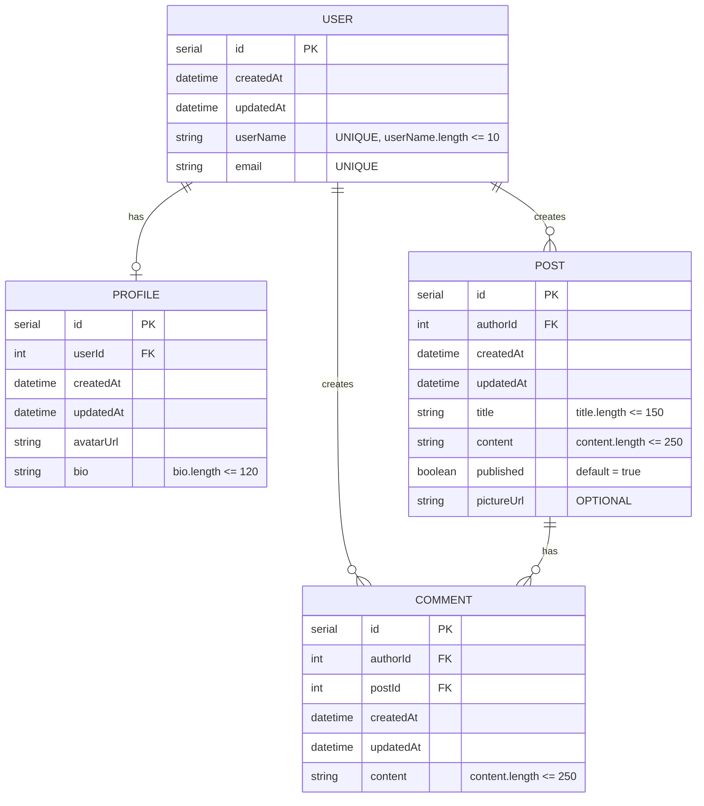

# ERD

```mermaid
erDiagram
    USER ||--o| PROFILE : has
    USER ||--o{ POST : creates
    USER ||--o{ COMMENT : creates
    POST ||--o{ COMMENT : has

    USER {
        serial id PK
        datetime createdAt
        datetime updatedAt
        string userName "UNIQUE, userName.length <= 10"
        string email "UNIQUE"
    }

    PROFILE {
        serial id PK
        int userId FK
        datetime createdAt
        datetime updatedAt
        string avatarUrl
        string bio "bio.length <= 120"
    }

    POST {
        serial id PK
        int authorId FK
        datetime createdAt
        datetime updatedAt
        string title "title.length <= 150"
        string content "content.length <= 250"
        boolean published "default = true"
        string pictureUrl "OPTIONAL"
    }

    COMMENT {
        serial id PK
        int authorId FK
        int postId FK
        datetime createdAt
        datetime updatedAt
        string content "content.length <= 250"
    }
```
